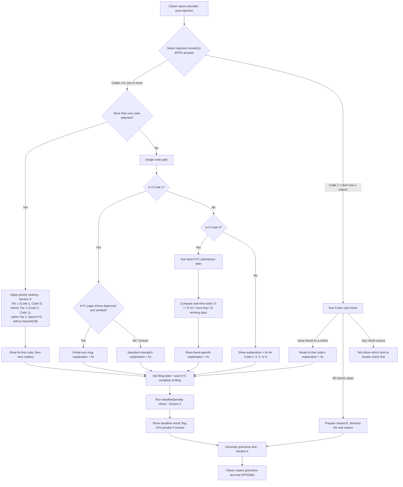
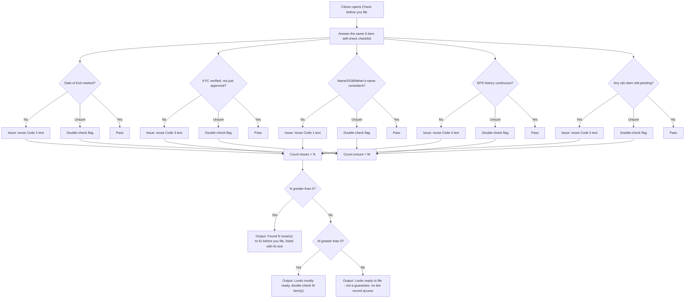

# EPFO Decoder — Rule Engine Spec

*Written 2026-08-29. Turns PRD.md Section 7a into logic a developer or designer can build directly. Written in Simplified Technical English: short sentences, one idea per sentence, plain words.*

**Source documents:** `PRD.md` (Sections 4, 7, 7a, 7b, 10) and `Research/EPFO Findings.md`. Every rule, code, and threshold below comes from those two files. Where a detail is flagged there as unverified, this spec repeats that flag. It does not invent new codes, thresholds, or rules.

---

## 1. Overview

The rule engine takes a citizen's own report of their EPFO Provident Fund claim — the rejection remark EPFO showed them, or the state of their KYC and claim records before they file — and turns it into a plain-language diagnosis and a ready-to-use next step. It has **two entry points**: the **post-rejection decoder** (the citizen already has a rejection) and the **pre-filing readiness check** (the citizen has not filed yet, and wants to check first). Both entry points share the same underlying rule library.

The engine has **four core functions**:
1. **Diagnose** — match what the citizen reports to one of 6 known rejection/failure codes (or a 7th "no reason given" fallback), and explain it in plain language.
2. **Prioritize** — when the citizen reports more than one code at once, rank them so the citizen fixes the real blocker first, not a secondary one (H10).
3. **Check deadline and penalty** — compare the citizen's filing date against EPFO's 3-day or 20-day settlement rule, and flag a missed deadline and its 12% penalty (H11).
4. **Generate grievance text** — produce ready-to-paste EPFiGMS grievance text, tailored to the diagnosed code and citing the missed deadline when one applies (H13).

---

## 2. Inputs and State

| Field | Type | Required / Optional | Notes |
|---|---|---|---|
| `entry_point` | enum: `post_rejection`, `pre_filing` | Required | Selects which flow runs (Section 8, diagrams a/b). |
| `uan` | string (UAN, typically 12 digits) | Optional for diagnosis only; **Required** to generate grievance text | Used to fill the grievance template. |
| `claim_id` | string | Optional for diagnosis only; **Required** to generate grievance text | Used to fill the grievance template. |
| `claim_type` | enum: `Form 19`, `Form 10C`, `Form 31`, `unsure` | Optional | Context only. Not used for branching — the exact claim-type eligibility conditions for the 3-day settlement rule are not yet confirmed (see Section 9, gap 2). |
| `rejection_codes_selected` | set of enum: `code1`…`code6`, `code7` | **Required** for `post_rejection` | Multi-select. See Section 3 for code definitions. `code6` and `code7` cannot be selected alongside another code (see Section 4). |
| `filing_date` | date | **Required** for `post_rejection` (feeds H11 check) | The date the citizen filed the claim now under review. |
| `kyc_complete_at_filing` | boolean | **Required** for `post_rejection` (feeds H11 check) | Citizen-reported: was their KYC complete when they filed? Drives the 3-day vs. 20-day branch. |
| `today_date` | date | System-provided | Not entered by the citizen. |
| `namedob_kyc_page_status` | enum: `approved_and_verified`, `not_verified`, `unsure` | **Required if `code1` selected** | Answers the branching sub-question in Section 3, Code 1. |
| `bank_kyc_submission_date` | date | **Required if `code3` selected** | Feeds the 3-band wait-time check in Section 3, Code 3. |
| `self_check_answers` | structured set of 5 answers, each `yes` / `no` / `unsure` (see list below) | **Required if `code7` selected**, or **always** for `pre_filing` | Same 5-item checklist reused across both cases (Section 3, Code 7; Section 7). |

**The 5-item self-check checklist** (used by Code 7 and by the pre-filing entry point — same fields, same logic):
- `doe_marked` — "Is your Date of Exit marked?"
- `kyc_verified_not_just_approved` — "Is your KYC verified, not just approved?"
- `name_dob_fathername_consistent` — "Is your name / DOB / father's name consistent across Aadhaar, UAN, PAN, and bank records?"
- `eps_history_continuous` — "Is your EPS contribution history continuous, with no zero or missing periods?"
- `old_claim_pending` — "Do you have any old claim (Form 19 / 10C / 31) still pending?"

Note: this 5-item list, not a 6-item one, is the concrete checklist. PRD §7a item 1 loosely says Code 7 checks "the other 6 codes," but PRD §7a item 5 spells out the actual checklist explicitly, and it lists 5 items — it excludes "approved but not credited" (Code 6), since that code describes a state that cannot exist on a claim that was just rejected with no reason given. This spec follows the explicit 5-item list.

---

## 3. The Rule Table

Each row: trigger, plain-language explanation copy (draft), recommended fix, and branching sub-questions.

### Code 1 — Name / DOB / father's-name mismatch

**Trigger:** citizen selects this remark; matches any EPFO remark citing a mismatch in name, date of birth, or father's name across Aadhaar, UAN, PAN, or bank records.

**Branching sub-question:** "Does your KYC page already show this detail as Approved and Verified?" (`namedob_kyc_page_status`)

- **If `not_verified` or `unsure` → standard mismatch branch:**
  - *Explanation:* "EPFO checks your name, date of birth, and father's name across four records: Aadhaar, your UAN profile, PAN, and your bank account. One of these records does not match the others. This is often a small thing — a spelling difference, or an initial written out in full. This is usually not your mistake. Different offices type your details differently over time."
  - *Fix:* "File a Joint Declaration to correct the mismatched detail. You and your employer both sign this on the UAN portal. Attach the record with the correct spelling — for example, your Aadhaar card. This tells EPFO which record to trust."

- **If `approved_and_verified` → portal-sync-bug branch:**
  - *Explanation:* "Your KYC page already shows this detail as Approved and Verified. Your record is correct. The claim screen has not caught up yet. This is a known sync problem between two EPFO systems. It is not a real mismatch in your data."
  - *Fix:* "Do not file a Joint Declaration. Do not change data that is already correct. Wait 24 to 48 hours and check again. If the claim screen still shows the old error after that, raise a grievance. Attach two screenshots: your KYC page showing Approved and Verified, and your claim status page showing the error."

### Code 2 — Date of Exit not marked

**Trigger:** citizen selects this remark; matches EPFO remarks stating the citizen's last working day at a previous employer is not recorded.

**Explanation:** "EPFO does not know your last working day at your previous employer. Your former employer must record this date — called your 'Date of Exit' — in EPFO's system. Until they do, EPFO's records show you as still working there. This blocks your claim. This is not your mistake. It is a step your former employer did not complete."

**Fix:** "Ask your former employer's HR or PF team to mark your Date of Exit on the EPFO employer portal. If they are slow or do not respond, file a grievance through EPFiGMS. Name your former employer, and ask EPFO to direct them to complete this step."

### Code 3 — Bank KYC not verified, or bank details mismatch

**Trigger:** citizen selects this remark; matches EPFO remarks about unverified bank KYC, or a mismatch in account number, IFSC code, or account-holder name.

**Branching sub-question:** bank KYC submission date (`bank_kyc_submission_date`), used to compute a wait-time band against `today_date`.

**Explanation (always shown first):** "EPFO must confirm that your bank account number, IFSC code, and account-holder name all match your other records before it can pay you. Your bank and NPCI verify this directly — since April 2025, your employer's approval is no longer part of this step. If the check is still in progress, or something doesn't match, your claim cannot move forward — even if every other part of it is approved."

**Wait-time bands** (working days between `bank_kyc_submission_date` and `today_date`):

**Re-anchored 2026-08-31 (ticket 13) — real, confirmed bug fix, not a refinement.** EPFO's own order, dated 3 April 2025, removed employer approval from bank-KYC seeding entirely: *"there shall be no requirement of approval of Employer in the bank account seeding process henceforth"* — pending employer-level requests now auto-approve once bank/NPCI verification clears, which the same order states averages ~3 working days. Confirmed via multiple convergent secondary sources (StaffNews, CAalley, United Consultancy, PlanivestFin) — `epfindia.gov.in`/`epfo.gov.in` both still 404 mid-migration, and `pib.gov.in` blocks direct fetch. The bands below (previously keyed to the *old* ~15-day-employer-then-Field-Office process) are re-anchored to the *current* process's stated average, with a buffer — a reasoned estimate, not an EPFO-published figure, same caveat status the original bands carried.

| Band | Range | Reading | Fix |
|---|---|---|---|
| 1 | 0–5 working days | "You submitted your bank KYC {X} working days ago. This is still within the typical bank/NPCI verification turnaround. No action is needed yet." | "No action needed. Check back after a few more working days." |
| 2 | 6–10 working days | "You submitted your bank KYC {X} working days ago. This is longer than the typical turnaround. It is worth checking, but not yet clearly stuck." | "Contact your bank to confirm your account number, IFSC code, and account-holder name were submitted correctly. If everything on their end looks correct and it still shows unverified, check again in a few more days." |
| 3 | more than 10 working days | "You submitted your bank KYC {X} working days ago. This is well beyond the typical bank/NPCI verification turnaround. It is worth escalating." | "Raise a grievance through EPFiGMS. Ask EPFO to check why your bank KYC verification is taking longer than the typical turnaround and confirm its status directly." |

**Caveat to show inline, briefly:** these bands are a reasoned estimate off EPFO's own stated ~3-working-day average for bank/NPCI verification, not an EPFO-published band table — EPFO's own Citizen Charter remains unreachable to check against (see Section 9, gap 1). No band or fix mentions the employer — that step no longer exists in this process.

### Code 4 — EPS (pension) discrepancy

**Trigger:** citizen selects this remark; matches EPFO remarks showing zero or missing Employee Pension Scheme (EPS) contributions for a period the citizen was working.

**Explanation:** "Your Employee Pension Scheme (EPS) contribution record shows zero, or is missing, for a period when you were working and should have had contributions. This often happens after a job change, when an employer's records and EPFO's records fall out of step."

**Fix:** "Contact your employer's HR or PF team for the period in question. Ask them to confirm they deposited your EPS contribution. If they confirm they did, file a grievance through EPFiGMS naming the exact period affected, so EPFO can investigate the gap in its own records."

### Code 5 — An old claim is still pending

**Trigger:** citizen selects this remark; matches EPFO remarks blocking a new claim because an earlier one (Form 19, 10C, or 31) is unresolved.

**Explanation:** "You have an earlier claim — a Form 19, 10C, or 31 — still open in EPFO's system. EPFO will not process a new claim while an old one is unresolved, even if you forgot about it."

**Fix:** "Check your claim history on the UAN portal for any old, unresolved claim. If you no longer need it, you may be able to withdraw or cancel it. If it should already have been settled, raise a grievance on that old claim first. Once it closes, refile your new claim."

### Code 6 — Approved, but the money never arrived

**Trigger:** citizen selects this option; the claim status shows approved, but no payment has reached the citizen's bank account.

**Explanation:** "EPFO approved your claim. The money has not reached your bank account. This is a different problem from a rejection — your claim passed, but the payment itself did not go through, or has not shown up yet."

**Fix:** "Check your EPFO passbook or claim status page for a payment reference number, sometimes called a UTR. Check your bank statement using this reference. If your bank confirms no such transfer arrived, raise a grievance through EPFiGMS, quoting your claim ID and approval date, and ask EPFO to trace the payment."

**Caveat to carry forward:** unlike Code 3, there is no source-backed number for how long is "too long" before this counts as stuck. Do not add a specific day-count to this copy without a source (see Section 9, gap 5).

### Code 7 — "I don't see a reason"

**Trigger:** EPFO shows no remark at all, or the citizen cannot find one; citizen selects this option instead of a code.

**Explanation (opening):** "EPFO has not told you why your claim was rejected. This can happen. It does not mean nothing is wrong — it means EPFO did not explain. Let's check the common causes yourself, one by one."

**Sub-flow:** run the 5-item self-check checklist (Section 2). For each `no` (or `yes` on `old_claim_pending`, which is the problem direction for that one item), route to that code's explanation and fix text (Codes 1, 2, 3\*, 4, 5). \*Note: the bank-KYC self-check item only confirms verification status; it does not collect a submission date, so the wait-time bands from Code 3 do not apply here — show the general Code 3 explanation only.

- **If every check comes back clean** (all `yes` in the pass direction, no `unsure`):
  - *Explanation:* "None of the common causes seem to apply to your case, as far as you can tell from your own records. EPFO has not given you a valid reason. You are entitled to know why your claim was rejected."
  - *Fix:* "File a grievance through EPFiGMS that explicitly asks EPFO to state the actual reason for rejection. Do not guess a fix — demand the reason first." (Generates the special "demand the real reason" grievance variant — see Section 6.)
- **If any check comes back `unsure`:** tell the citizen which item(s) to double-check before concluding "no reason found" (do not treat `unsure` as clean).

---

## 4. Priority-Check Logic (H10)

Applies only when `rejection_codes_selected` contains **2 or more** of Codes 1, 2, 3, 4, 5. (Codes 6 and 7 are mutually exclusive with the other codes at the UI level — a claim cannot be simultaneously "rejected with reason X" and "approved but not credited" or "no reason given.")

**The two tiers, from PRD §7a item 2:**
- **Tier 1 — blocks eligibility first:** Code 2 (Date of Exit not marked), Code 5 (old claim pending). These are checked earlier in EPFO's process — a claim cannot even be considered eligible for processing until these clear.
- **Tier 2 — blocks payment outright:** Code 3 (Bank KYC), Code 1 (Name/DOB mismatch). These are checked later — they stop the money moving once the claim is otherwise eligible. Within Tier 2, **Bank KYC ranks above Name/DOB mismatch** — this specific order is stated directly in the source finding: "a bank-KYC block should be fixed before a details-mismatch block, since payment cannot move either way until KYC clears."
- **Unranked:** Code 4 (EPS discrepancy) is not addressed by the source finding's priority discussion. Treat it as independent — show its own explanation/fix, but do not claim a rank relative to the other four. Flagged in Section 9, gap 4.

**Decision table:**

| Selected codes | Fix-first result |
|---|---|
| Any one of Code 2 or Code 5, plus any one of Code 1 or Code 3 | Fix the Tier 1 code first (eligibility), then the Tier 2 code (payment). |
| Both Code 1 and Code 3 selected | Fix Code 3 (Bank KYC) first, then Code 1 (Name/DOB mismatch). |
| Both Code 2 and Code 5 selected | No source-stated order between these two Tier 1 codes — show both together as "fix these before anything else," unranked relative to each other. |
| Code 4 selected alongside any other code | Show Code 4's explanation/fix separately, without claiming a priority rank against the other selected code(s). |
| Only one code selected | No ranking needed — show that code's explanation/fix alone. |

**Pseudocode:**

```
function prioritize(selected_codes: Set<Code>) -> ordered result:
    if size(selected_codes) <= 1:
        return selected_codes   # nothing to rank

    tier1 = selected_codes ∩ {CODE_2_DOE, CODE_5_OLD_CLAIM}
    tier2 = selected_codes ∩ {CODE_3_BANK_KYC, CODE_1_NAME_DOB}
    tier2_ordered = order_by(tier2, [CODE_3_BANK_KYC, CODE_1_NAME_DOB])
    unranked = selected_codes - tier1 - tier2   # e.g. CODE_4_EPS

    ranked = list(tier1) + tier2_ordered   # tier1 has no internal order defined
    show "Fix this first:" + explanation/fix for ranked[0] (or all of tier1 if |tier1| > 1)
    show "Then fix:" + explanation/fix for the rest of `ranked`
    show unranked codes separately, without a rank claim
    return ranked, unranked
```

---

## 5. Deadline / Penalty Check Logic (H11)

Runs whenever `entry_point = post_rejection` and `filing_date` + `kyc_complete_at_filing` are provided. Independent of which code(s) were selected — it always runs, and its result is appended to whichever diagnosis/priority output the citizen already saw.

**Caveat carried into this logic:** the source states "3 days (complete KYC)" and "20 days (otherwise)" without specifying whether these are calendar days or working days (unlike the Code 3 wait-time bands, which are explicitly "working days"). This spec treats them as **calendar days**, matching how the rule is generally described in news coverage, but this is an assumption, not a confirmed detail — flagged in Section 9, gap 6.

**Pseudocode:**

```
function check_deadline(filing_date: date, kyc_complete_at_filing: bool, today_date: date) -> result:
    deadline_days = kyc_complete_at_filing ? 3 : 20
    deadline_date = filing_date + deadline_days   # calendar days — see caveat above

    if today_date <= deadline_date:
        days_remaining = deadline_date - today_date
        status = NOT_YET_DUE
    else:
        days_late = today_date - deadline_date
        status = MISSED

    return { status, deadline_date, days_remaining (if NOT_YET_DUE), days_late (if MISSED) }
```

**Plain-language output templates:**

- **If `status = NOT_YET_DUE`:**
  > "You filed your claim on {filing_date}. Because your KYC was {complete / not complete} when you filed, EPFO must settle your claim within {3 / 20} days — by {deadline_date}. Today is {today_date}. EPFO still has {days_remaining} day(s) left to settle your claim."

- **If `status = MISSED`:**
  > "You filed your claim on {filing_date}. Because your KYC was {complete / not complete} when you filed, EPFO had to settle your claim within {3 / 20} days — by {deadline_date}. Today is {today_date}. EPFO has missed this deadline by {days_late} day(s). You may be owed a 12% penalty interest on your claim amount for this delay. Ask for this penalty by name when you file your grievance."

---

## 6. Grievance-Generation Logic (H13)

Runs after diagnosis (and priority ranking, if applicable) and the deadline check. Produces text the citizen copies into EPFiGMS's free-text description box. **Only the first-level EPFiGMS grievance is in the 9-day MVP** — a second-level CPGRAMS escalation template is named v2 scope in PRD §7a item 6 and is not built here (see Section 9, gap 7).

**Note on scope, updated 2026-08-31 (ticket 14):** EPFO Findings confirms EPFiGMS has "a category dropdown + free-text box." The exact taxonomy is still not captured — confirmed unreachable: the dropdown only renders after a real citizen's UAN + OTP login on the live EPFiGMS form, and no secondary source documents the exact list either (checked: ClearTax, BankBazaar, IndMoney, Paytm, Jainam, Motilal Oswal, Bajaj Finserv, Canara HSBC — all describe only broad category names in prose, none show the authenticated form). Rather than block on this indefinitely, every variant below now also returns a **`suggestedCategory`** — a best-guess broad category ("PF Withdrawal" for most variants, "Pension Settlement" for the EPS-related standard case), always shown to the citizen with an explicit caveat that it's a guess, never presented as a confirmed EPFiGMS value. **Phase 2 follow-up (PRD §10):** once a real volunteer walks through the live form with their own UAN/OTP, replace this guess with the exact captured mapping.

**Common placeholders:** `{UAN}`, `{CLAIM_ID}`, `{CODE_NAME}`, `{TODAY_DATE}`, `{DEADLINE_CITATION}` (block below, appended only when `status = MISSED`).

**Deadline citation block** (appended to any variant below, when applicable):
> "I also note that EPFO's own rule requires settlement within {3 / 20} days of filing (filed {filing_date}). This deadline was missed by {days_late} day(s). Under EPFO's delay-penalty rule, I am entitled to 12% penal interest on my claim amount for this delay. I request this penalty be applied."

### Variant A — standard rejection (Codes 1, 2, 4, 5)

> Subject: Grievance regarding rejection of PF claim — {CODE_NAME}
>
> My PF withdrawal claim (Claim ID: {CLAIM_ID}, UAN: {UAN}) was rejected. The stated reason was: {CODE_NAME}. [One-sentence restatement of the issue, drawn from that code's explanation text in Section 3.] I request EPFO to review and resettle my claim.
>
> {DEADLINE_CITATION, if applicable}

### Variant B — bank KYC, escalation band only (Code 3, wait-time Band 3)

**Re-anchored 2026-08-31 (ticket 13):** no longer references employer approval — see Section 3's Code 3 note.

> Subject: Grievance regarding unverified bank KYC — Claim ID {CLAIM_ID}
>
> My PF claim (Claim ID: {CLAIM_ID}, UAN: {UAN}) is blocked because my bank KYC is not verified. I submitted my bank KYC on {bank_kyc_submission_date}. This has taken longer than the typical bank/NPCI verification turnaround. I request EPFO to check the status of my bank KYC verification directly and resettle my claim.
>
> {DEADLINE_CITATION, if applicable}

*(For Bands 1 and 2, no grievance is generated — the recommended action is to wait or check with your bank directly, not to file a grievance yet.)*

### Variant C — portal sync bug (Code 1, `namedob_kyc_page_status = approved_and_verified`)

> Subject: Grievance — claim screen shows outdated mismatch, KYC page already Approved and Verified — Claim ID {CLAIM_ID}
>
> My PF claim (Claim ID: {CLAIM_ID}, UAN: {UAN}) was rejected for a name/DOB/father's-name mismatch. My KYC page already shows this detail as Approved and Verified (screenshot attached). My claim status page still shows this as an error (screenshot attached). This appears to be a synchronization issue between EPFO's KYC and claim-processing systems, not an actual mismatch in my records. I request EPFO to correct this synchronization issue and reprocess my claim without requiring a new Joint Declaration.
>
> {DEADLINE_CITATION, if applicable}

### Variant D — approved but not credited (Code 6)

> Subject: Grievance — PF claim approved but payment not received — Claim ID {CLAIM_ID}
>
> My PF claim (Claim ID: {CLAIM_ID}, UAN: {UAN}) was approved. The payment has not reached my bank account as of {TODAY_DATE}. I have checked my bank statement and found no matching transfer. I request EPFO to trace this payment and confirm its status, or reissue it if it failed.
>
> {DEADLINE_CITATION, if applicable}

### Variant E — "demand the real reason" (Code 7, all self-checks clean)

> Subject: Grievance — PF claim rejected with no reason given — Claim ID {CLAIM_ID}
>
> My PF claim (Claim ID: {CLAIM_ID}, UAN: {UAN}), filed on {filing_date}, was rejected. EPFO's claim status did not state a reason. I have checked my own records for the common causes of rejection — Date of Exit, KYC verification, name/DOB/father's-name consistency, EPS contribution history, and any pending old claim — and found no issue on my end. I request EPFO to state the specific reason my claim was rejected, and to reprocess my claim once I have that information.
>
> {DEADLINE_CITATION, if applicable}

---

## 7. Pre-Filing Readiness-Check Flow (H14)

Second entry point (`entry_point = pre_filing`). Reuses the exact same 5-item self-check checklist as Code 7 (Section 2), each answered `yes` / `no` / `unsure`, and the same explanation/fix text already written for Codes 1–5. **"Approved but not credited" (Code 6) is excluded** — it can only happen after a claim is filed and approved, so it has no meaning before filing (per PRD §7a item 5).

**Per-check pass/fail direction** (note the polarity flips for the "old claim pending" question — a `yes` there is the problem, unlike the other four):

| Check | "Pass" answer | "Issue" answer | On issue, reuse |
|---|---|---|---|
| `doe_marked` | yes | no | Code 2 explanation/fix |
| `kyc_verified_not_just_approved` | yes | no | Code 3 explanation/fix (general text only — no submission date is collected here, so no wait-time band) |
| `name_dob_fathername_consistent` | yes | no | Code 1 explanation/fix (standard branch — the portal-sync-bug branch does not apply pre-filing, since there is no claim screen yet to disagree with the KYC page) |
| `eps_history_continuous` | yes | no | Code 4 explanation/fix |
| `old_claim_pending` | no | yes | Code 5 explanation/fix |

An `unsure` answer on any check counts as neither pass nor issue — it goes into a separate "double-check" bucket.

**Overall output logic:**

```
function readiness_result(answers: 5 answers) -> output:
    issues = answers where direction == "issue"
    unsure = answers where direction == "unsure"
    N = count(issues)
    M = count(unsure)

    if N == 0 and M == 0:
        return "Looks ready to file. Based on what you told us, none of the common
                blockers apply to your claim. This is not a guarantee — we cannot see
                your actual EPFO record — but you have checked the most common causes
                of rejection."
    if N == 0 and M > 0:
        return "Looks mostly ready. Double-check {M} thing(s) before you file: {list
                the unsure items, each with its check question}."
    if N > 0:
        return "Found {N} issue(s) to fix before you file: {list each issue with its
                reused explanation + fix text}. Also double-check {M} more thing(s)
                you were unsure about, if any."
```

No priority ranking (Section 4) applies here — the pre-filing flow surfaces every issue found, since there is no live EPFO remark to rank against; the citizen has not filed yet. No deadline/penalty check (Section 5) applies here either, since there is no `filing_date` yet.

---

## 8. Workflow Diagrams

### (a) Post-rejection decoder — start to grievance output



### (b) Pre-filing readiness-check flow



---

## 9. Open Gaps / Do-Not-Ship-Yet Flags

Carried forward from PRD.md and EPFO Findings.md, scoped to items that affect the rule engine specifically:

1. **Bank-KYC wait-time thresholds (0–7 / 8–15 / more than 15 working days) are secondary-sourced only.** EPFO's own Citizen Charter PDF 404'd on both `epfindia.gov.in` and `epfo.gov.in` during this research, mid-EPFO-3.0-migration. Only the "more than 15 days" cutoff is backed by an actual EPFO rule (the Field Office backstop); the two shorter bands are estimates. Re-check against the primary document once EPFO's site stabilizes, before this exact copy and these exact day-counts ship (PRD §10, EPFO Findings "Open items to verify").

2. **The 3-day settlement rule's exact eligibility conditions are unconfirmed** — which claim types qualify, and what precisely counts as "complete KYC." The rule went live 3 July 2026, is under two months old as of this research, and formal EPFO circulars were not yet available to check. The engine currently takes `kyc_complete_at_filing` as a citizen-reported boolean rather than deriving it from claim type or KYC field status — this is a reasonable MVP simplification, but it means the 3-day/20-day branch (Section 5) trusts the citizen's own judgment of "complete," which may not match EPFO's formal definition.

3. **Whether the 3-day/20-day rule counts calendar days or working days is not stated in the source.** This spec assumes calendar days (Section 5) as a working assumption, unlike the Code 3 wait-time bands, which are explicitly stated as working days in the source. Confirm before shipping the deadline-check output copy.

4. **EPS discrepancy (Code 4) has no established position in the H10 priority ranking.** PRD §7a item 2 only classifies Codes 1, 2, 3, and 5 into the eligibility/payment tiers. Section 4 of this spec treats Code 4 as unranked by design, not by omission — do not silently assign it a tier without new source evidence.

5. **No source-backed wait-threshold exists for Code 6 ("approved but not credited").** Unlike Code 3's 15-day, rule-backed cutoff, nothing in the source material says how long a missing payment should wait before it counts as "stuck." The current copy (Section 3, Code 6) deliberately avoids stating a number for this reason.

6. **The EPFiGMS category-dropdown taxonomy still isn't captured — confirmed unreachable, not just unresearched (ticket 14, 2026-08-31).** The dropdown only renders after a real citizen's UAN + OTP login on the live form; no secondary source documents the exact list either. Section 6's grievance output now carries a `suggestedCategory` broad-category guess (with an explicit caveat shown to the citizen) instead of blocking on this. Still open: swapping the guess for the exact mapping once a real Phase 2 volunteer reports back what they actually saw on the authenticated form.

7. **Only the first-level EPFiGMS grievance is built here, by design.** PRD §7a item 6 and §10 leave the second-level CPGRAMS escalation template as an explicit "decide once test-plan results are in" item — still open as of this writing. If it gets built, it reuses this same generator (Section 6) with a different template, not a new engine.

8. **The 34% (2022-23) EPF rejection-rate figure is unverified** against EPFO's own annual report or a parliamentary reply — currently sourced from news coverage only (PRD §10). This does not change any rule-engine logic, but if the product ever cites this figure in-product (for example, in framing copy like "you are not alone"), it should not be presented as a settled number yet.

9. **This whole rule library has been validated against 15 real cases, not live-tested with real users.** PRD §7b test-plan step 1 (matching the rule library against 15 real r/EPFOQueries cases) is done and passed. Step 2 — live volunteers testing actual decoder output — has not run yet. Nothing in this spec should be treated as user-validated copy until that step completes.

10. **Clarification found while implementing the backend (2026-08-29): Code 7's "issue found" path DOES generate a grievance, same as every other diagnosis path.** Section 3's prose is silent on this (it only says "route to that code's explanation and fix text"), while the Section 8a workflow diagram clearly routes this path (node E) through the deadline check into grievance generation (node V) — the same terminal node every other single-code path reaches. The implementation follows the diagram: a self-check issue gets the same Variant A grievance it would get if that code had been selected directly, using the first issue found (in the checklist's fixed order) as the subject when more than one issue is found. The one exception is a bank-KYC (Code 3) issue found this way — no submission date is collected in the self-check, so there's no wait-time band to justify Variant B's escalation text, and Variant A never covers Code 3 (Section 6 scopes it to Codes 1, 2, 4, 5 only); no grievance is generated in that specific case. See `lib/rule-engine/index.ts`'s `kindForSelfCheckIssue`.
